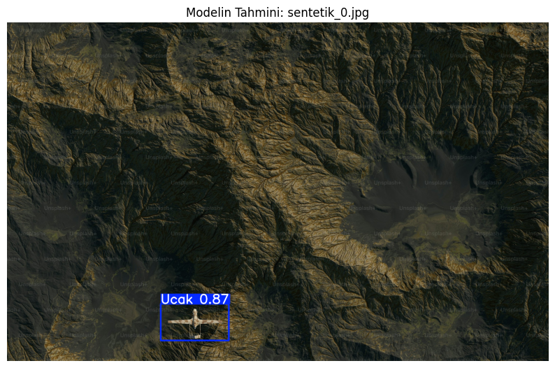

# YOLOv8 Plane Detection Project

This repository contains a simple and efficient implementation of object detection using the **Ultralytics YOLOv8** framework. The project is designed to run seamlessly on Google Colab.

## 📌 Overview
The goal of this project is to train and test a state-of-the-art object detection model (YOLOv8). It covers everything from environment setup to model inference.

## 🚀 How to Use
1. **Open the Notebook**: Upload `model.ipynb` to [Google Colab](https://colab.research.google.com/).
2. **Setup**: The first cells will automatically install the necessary `ultralytics` library.
3. **Hardware**: Make sure to enable **GPU** (T4) via `Runtime > Change runtime type`.
4. **Run**: Execute the cells in order to train the model and see the detection results.

## 🛠️ Technologies Used
* **Python**
* **Ultralytics YOLOv8**
* **Google Colab** (GPU Acceleration)
* **OpenCV & Matplotlib** (for visualization)

## 📁 Key Files
* `model.ipynb`: The main notebook with all the code and documentation.

---
*Developed for research and educational purposes.*

.png)
.png)
